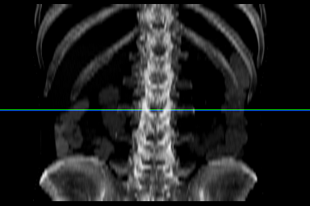
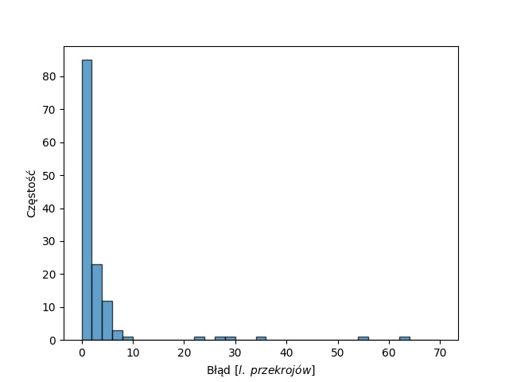
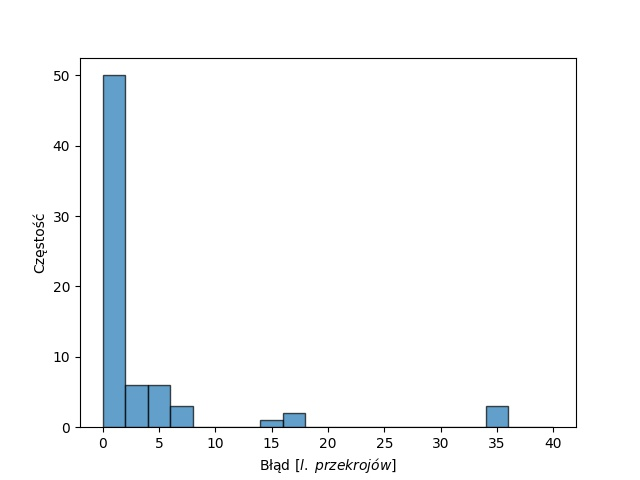

# Deep learning for spotting T12 and L3 slices in CT scans 
This repo contains code for my engineering thesis: *The use of deep learning methods to determine characteristic axial cross-sections in the tomographic examination of the abdomen and chest for the diagnosis of metabolic diseases* (originally written in Polish). 

**This README file is going to be updated soon.**

Abstract:
> The motivation for creation of present thesis is a need to automate determining T12 and L3 slices in 3D CT images. Such slices, being 2D grayscale images, are currently applied, as an example, for examining and diagnosing metabolic diseases, such as diabetes or osteoporosis. In addition, they prove to be helpful in measuring sarcopenia and forecasting digestive system cancers. As part of work, 2 deep learning models with satysfying accuracy on test sets were created - one for spotting L3 slice, with a median error of 0.9 slice (without rounding), second for spotting T12 slice, with a median error of 1 slice. In order to find those models, many experiments were conducted basing on methods already present in literature. The contribution of present thesis is evaluating current methods on larger datasets containing examinations of different kinds and developing a method for more reliable calculation of Maximal Intensity Projection images which constitute compressed, 2D images of skeletons and serve as an input to the models. Moreover, conducted experiments showed that evaluation methods employed in related works did not provide a good estimate, therefore other techniques were suggested. In addition, currently existing models were modified and extended. However, it did not yield better results. The thesis resulted in code for reconducting experiments as well as predicting slices for prepared CT scans. Script for prediction utilizes trained models and returns .csv file with supplied examinations IDs and corresponding predicted T12 or L3 slices numbers.

Example of L3 prediction:


Errors histograms (on test set, measured in slices):



### How to use (prediction)
1. Make sure you meet requirements listed below.
2. Download [models' weights](https://drive.google.com/drive/folders/1Uk0oNfgHfusin24GgE9zn7pfy4zQlq0G?usp=sharing) (one for L3, one for T12).
3. Preprocess your CT scans using [notebooks](./ct_preprocessing) (for thesis, ```.raw```, ```.dcm``` and ```.nii.gz``` files were preprocessed) to obtain ```.npz``` archive file with MIPs, exam IDs, and slices' thicknesses. Put it into a ```data``` directory.
4. Set ```INF_V_LEVEL``` (vertebrae for which you want to predict slices numbers), ```INF_DS_NAME``` (your ```.npz``` filename) and ```VISUALIZE``` (for getting predictions overlayed on MIPs as well) in [config file](./src/config.py).
5. Run ```main_infer.py```. Predicted slices numbers will be saved inside a ```.csv``` file.

### How to use (training)
1. Make sure you meet requirements listed below.
2. Download [MIPs](https://drive.google.com/drive/folders/1JK-jXrNCWwMo0KlLgA0QLf0emY6Gg8wd?usp=sharing).
3. Set params in [config file](./src/config.py).
4. Run ```main_train.py```.

### How to use (calculating MIPs)
1. Make sure you meet requirements listed below.
2. Choose one of the [notebooks](./ct_preprocessing) that suits your CT scans format and modify as needed.
3. Run the notebook.

### Requirements
* Python >= 3.8
* ```imgaug```
* ```opencv```
* ```tensorflow 2```
* ```nibabel```
* ```numpy```
* ```pandas```
* ```matplotlib```
* ```scikit-learn```
* ```scipy```

### Repo structure
```
.
|--- checkpoints         # (to download) best models' (T12 and L3) checkpoints
|--- ct_preprocessing    # (to run) notebooks for calculating MIPs from CT scans
     |--- datasets       # (to download) contains datasets used for experiments
|--- data                # (to download) contains .npz files with MIPs
|--- figures             # currently just test set errors histograms
|--- logs                # best models' training logs
|--- src                 # .py files for loading MIPs and training the models
|--- main_eval.py        # (to run) script used for evaluating the models
|--- main_infer.py       # (to run) script used for inference (new data)
|--- main_train.py       # (to run) script used for training the models
```

### Related works
https://github.com/fk128/sarcopenia-ai 

### Data
MIPs used for training, validation and testing are available on [Google Drive](https://drive.google.com/drive/folders/1JK-jXrNCWwMo0KlLgA0QLf0emY6Gg8wd?usp=sharing). 

Original CTs datasets:
* 1006 CTs from https://github.com/fk128/sarcopenia-ai
* 160 CTs from https://osf.io/nqjyw/ 
* 109 + 140 private CTs (to be uploaded)

